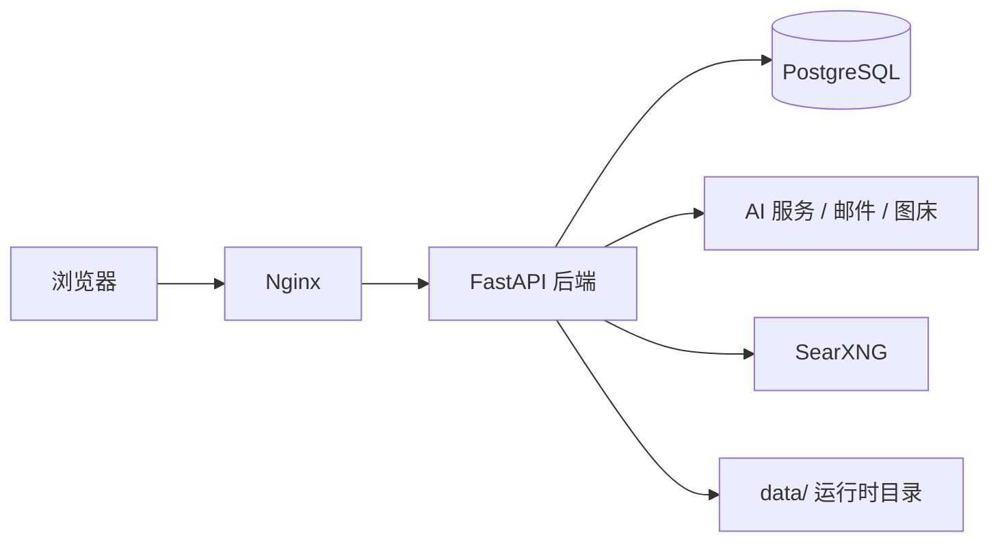

# Atelier AI Workbench

Atelier AI Workbench 是一个把 AI 对话、图像创作、文件处理、联网搜索和自动化工具整合在一起的全栈工作台。


## 功能

- AI 对话与流式响应
- AI 图像生成与图片管理
- 文件上传、文档解析和工作区工具
- 联网搜索与提示词优化
- 用户、积分、订阅和管理后台

## 架构



## 快速开始

### Docker Compose

```bash
cp .env.example .env
```

编辑 `.env`，至少设置 `PG_PASSWORD`、`JWT_SECRET` 以及所使用 AI 服务的 API 配置，然后运行：

```bash
chmod +x deploy-first-time.sh
./deploy-first-time.sh
```

服务启动后默认通过 `http://127.0.0.1:5173` 访问。

常用命令：

```bash
docker compose up -d
docker compose ps
docker compose logs -f app
docker compose down
```

### 本地开发

后端依赖安装：

```bash
python3 -m venv .venv
. .venv/bin/activate
pip install -r backend/requirements.txt
```

前端开发：

```bash
cd frontend
npm install
npm run dev
```

后端开发服务：

```bash
python -m uvicorn backend.main:app --reload --port 8002
```

## 配置

配置通过根目录 `.env` 读取，完整字段和示例见 `.env.example`。常用配置如下：

| 配置 | 作用 |
| --- | --- |
| `PG_PASSWORD` | PostgreSQL 密码，Docker 部署必填 |
| `JWT_SECRET` | 登录令牌签名密钥 |
| `IMAGE_GEN_API_URL` / `IMAGE_GEN_API_KEY` | 图像生成服务 |
| `LLM_BASE_URL` / `LLM_API_KEY` / `LLM_MODEL` | 对话和提示词优化服务 |
| `SEARXNG_URL` | 联网搜索服务地址 |
| `MINERU_API_KEY` | 可选的云端文档解析服务 |

不要把真实 API Key、数据库密码、JWT 密钥或邮件凭据提交到 Git。

运行时数据库、上传文件、模型缓存和本地配置位于 `data/`，该目录默认不纳入版本控制。

## 测试与构建

```bash
cd frontend
npm run lint
npm run test
npm run build
```

后端测试使用 pytest（开发环境可安装 `backend/requirements-dev.txt`）：

```bash
pip install -r backend/requirements-dev.txt
pytest backend/tests
```

## 安全

生产环境请使用强随机密码和密钥，限制管理后台访问范围，并通过 HTTPS 暴露服务。公开部署前请确认 `.env`、数据库、上传文件和模型缓存均未进入 Git 历史。

## 常见问题

### 为什么启动时报 `PG_PASSWORD must be set`？

Docker Compose 不提供生产数据库默认密码。复制 `.env.example` 后，在 `.env` 中设置 `PG_PASSWORD`。

### 为什么没有提交 `data/`？

`data/` 保存数据库、上传文件、模型缓存和运行时配置，属于部署实例数据。新环境启动后会创建所需目录，已有实例的数据不会被代码更新覆盖。

### 联网搜索不可用怎么办？

确认 SearXNG 容器状态和 `SEARXNG_URL`。Docker 内部默认使用 `http://searxng:8080`，本地直接运行后端时应填写本机可访问的地址。

### 为什么图像或对话功能没有结果？

检查对应的 API 地址、API Key 和模型配置，并查看 `docker compose logs -f app` 获取后端错误信息。

## 排错速查

| 现象 | 原因 | 处理 |
| --- | --- | --- |
| 容器无法创建数据库 | 未设置 `PG_PASSWORD` | 在 `.env` 设置后重新执行 `docker compose up -d` |
| 页面打不开 | 前端容器未启动或端口被占用 | 执行 `docker compose ps` 和 `docker compose logs -f app` |
| 搜索无结果 | SearXNG 未就绪 | 执行 `docker compose logs -f searxng` 并确认 `SEARXNG_URL` |
| 登录后立即失效 | `JWT_SECRET` 为空或被更换 | 设置稳定的随机 `JWT_SECRET` 后重启应用 |
| 文件上传失败 | 超出大小或扩展名限制 | 检查 `MAX_FILE_SIZE_MB` 和 `ALLOWED_EXTENSIONS` |
| AI 请求失败 | 上游地址、模型或 API Key 配置错误 | 检查 `.env` 和应用日志 |

## License

[MIT](LICENSE)
