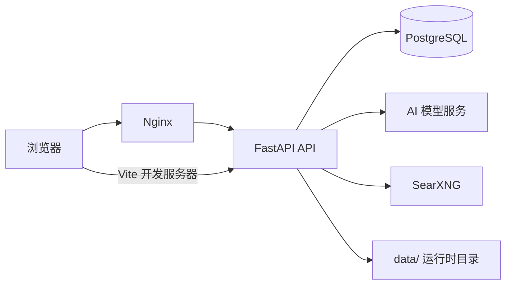

# Atelier AI Workbench

> 把对话、创作、文件、搜索和自动化工具放进一个可自托管的 AI 工作台。

[](LICENSE)


Atelier AI Workbench 面向希望自己掌控模型、数据和部署方式的个人与小团队。它提供统一的 Web 工作台，把多模型对话、图像创作、文档处理、联网搜索、提示词管理和 Agent 工具串成一条工作流。

> 当前版本定位为可自托管的实验性工作台。宣传图用于表达产品方向，不代表具体功能截图；真实运行 Demo 仍待录制。

## ✨ 功能特性

- 💬 **多模型 AI 对话**：支持流式输出、长任务后台执行和会话记忆。
- 🎨 **图像创作**：调用已配置的图像模型生成、管理和延长图片有效期。
- 📎 **多模态文件处理**：上传图片、PDF、DOCX、XLSX、PPTX 和文本文件。
- 🧠 **Agent 工具链**：提供联网搜索、文件操作、网页抓取、文档总结和科研作图工具。
- 🔎 **联网搜索**：通过 SearXNG 接入搜索能力，并提供请求限流和上游保护。
- ✍️ **提示词工作流**：提示词收藏、分类、优化和基于向量的相似内容检索。
- 🗂️ **个人工作区**：按用户隔离文件和任务，支持异步生成与任务状态恢复。
- 💳 **账户与权益**：包含账户、积分、套餐、订阅、充值和管理后台能力。
- 🔐 **安全边界**：凭据从环境变量读取，文件工具有工作区限制，远程图片请求包含 SSRF 防护。

## 📐 架构



- 前端：React、Vite、React Router、Axios、Vitest。
- 后端：FastAPI、SQLAlchemy、Alembic、Pydantic。
- 部署：Docker Compose 运行应用、PostgreSQL 和 SearXNG。
- 数据：数据库、上传文件、模型缓存和运行时配置保存在本地 `data/`，不进入 Git。

## 🚀 快速开始

### 前提

- Linux 服务器或本地环境。
- Docker Engine 和 Docker Compose；推荐使用 Docker 方式运行完整服务。
- 至少一个可用的 AI 服务 API，以及对应的 API Key。

### Docker 部署

1. 准备环境变量：

   ```bash
   cp .env.example .env
   ```

2. 编辑 `.env`，至少设置以下配置：

   ```dotenv
   PG_PASSWORD=请替换为强密码
   JWT_SECRET=请替换为随机密钥
   IMAGE_GEN_API_URL=https://your-image-api.example/v1
   IMAGE_GEN_API_KEY=请填写图像服务密钥
   LLM_BASE_URL=https://your-llm-api.example/v1
   LLM_API_KEY=请填写对话服务密钥
   LLM_MODEL=请填写模型名称
   ```

3. 启动服务：

   ```bash
   chmod +x deploy-first-time.sh
   ./deploy-first-time.sh
   ```

4. 访问 `http://127.0.0.1:5173`，使用 `.env` 中的管理员账号完成首次登录。

常用运维命令：

```bash
docker compose up -d
docker compose ps
docker compose logs -f app
docker compose down
```

### 本地开发

后端依赖：

```bash
python3 -m venv .venv
. .venv/bin/activate
pip install -r backend/requirements-dev.txt
python -m uvicorn backend.main:app --reload --port 8002
```

前端依赖和开发服务器：

```bash
cd frontend
npm install
npm run dev
```

本地后端需要可访问的 PostgreSQL 和 SearXNG，并将对应地址写入 `.env`。前端开发服务器默认通过项目 API 配置访问后端。

## ⚙️ 配置

`.env.example` 是完整配置清单。以下是最常用的配置项：

| 配置 | 类型 | 说明 |
| --- | --- | --- |
| `PG_USER` | string | PostgreSQL 用户，默认 `app_user` |
| `PG_PASSWORD` | string | PostgreSQL 密码，Docker 部署必填 |
| `PG_DB` | string | PostgreSQL 数据库名，默认 `app_db` |
| `JWT_SECRET` | string | 登录令牌签名密钥 |
| `ADMIN_USERNAME` | string | 首次运行创建的管理员账号 |
| `ADMIN_PASSWORD` | string | 首次运行创建的管理员密码 |
| `IMAGE_GEN_API_URL` | URL | 图像生成 API 地址 |
| `IMAGE_GEN_API_KEY` | string | 图像生成 API Key |
| `LLM_BASE_URL` | URL | 对话/优化模型 API 地址 |
| `LLM_API_KEY` | string | 对话/优化模型 API Key |
| `LLM_MODEL` | string | 对话模型名称 |
| `SEARXNG_URL` | URL | 联网搜索服务地址，Docker 默认 `http://searxng:8080` |
| `MINERU_API_KEY` | string | 可选，云端文档解析服务 Key |
| `MAX_FILE_SIZE_MB` | integer | 上传文件大小限制，默认 `20` |
| `ALLOWED_ORIGINS` | CSV | 允许的前端来源列表 |

安全要求：真实 `.env`、数据库密码、JWT 密钥、支付配置、邮件凭据和模型 API Key 只放在部署环境，不要提交到 Git。

## ⌨️ 命令表

| 命令 | 用途 |
| --- | --- |
| `./deploy-first-time.sh` | 首次检查环境、构建并启动完整 Docker 服务 |
| `./deploy-update.sh` | 服务器上执行迁移、重建并重启应用 |
| `./quick.sh start` | 启动全部 Compose 服务 |
| `./quick.sh stop` | 停止全部 Compose 服务 |
| `./quick.sh status` | 查看 Compose 服务状态 |
| `./quick.sh logs app` | 查看应用日志 |
| `./quick.sh update` | 只重建并更新应用服务 |
| `npm run dev` | 启动前端开发服务器 |
| `npm run build` | 构建前端生产文件 |
| `npm run test` | 运行前端测试 |
| `pytest backend/tests` | 运行后端测试 |

## 🧪 测试与构建

```bash
cd frontend
npm run lint
npm run test
npm run build
cd ..
pytest backend/tests
```

当前前端构建通过，lint 无 error；仍有 React hooks 等已有 warning，后续会单独处理。

## 🔐 安全说明

- 凭据只从环境变量读取，`.env` 不纳入版本控制。
- `data/` 保存实例数据，包含数据库、上传文件和模型缓存，不随代码更新覆盖。
- Agent 文件工具限制在用户工作区，并校验文件路径和文件大小。
- 远程图片抓取会校验解析后的地址，阻止访问非公开网络地址。
- 生产部署应使用 HTTPS、强密码、稳定的 `JWT_SECRET` 和受限的管理后台访问策略。

## ❓ 常见问题

### 为什么启动时报 `PG_PASSWORD must be set`？

这是预期行为。Compose 不再提供生产数据库默认密码，请在 `.env` 中设置 `PG_PASSWORD`。

### 为什么新 clone 的项目没有 `data/`？

`data/` 是实例运行目录，包含数据库、上传内容和模型缓存。首次启动时会创建所需目录；已有部署的数据不会随 Git 代码同步。

### 为什么联网搜索不可用？

确认 `searxng` 容器已经运行，并检查 `SEARXNG_URL`。Docker 内部使用 `http://searxng:8080`，直接运行后端时需要填写后端可访问的 SearXNG 地址。

### 为什么 AI 对话或图像生成失败？

检查对应的 API 地址、模型名称和 API Key，然后查看：

```bash
docker compose logs -f app
```

### 为什么上传文件失败？

检查文件是否超过 `MAX_FILE_SIZE_MB`，以及扩展名是否包含在 `ALLOWED_EXTENSIONS` 中。

## 🛠️ 贡献

欢迎提交 Issue 和 Pull Request。提交前请确保不包含 `.env`、`data/`、生产配置、用户上传内容或其他凭据，并运行前端构建和相关测试。

## 📄 License

本项目使用 [MIT License](LICENSE)。
