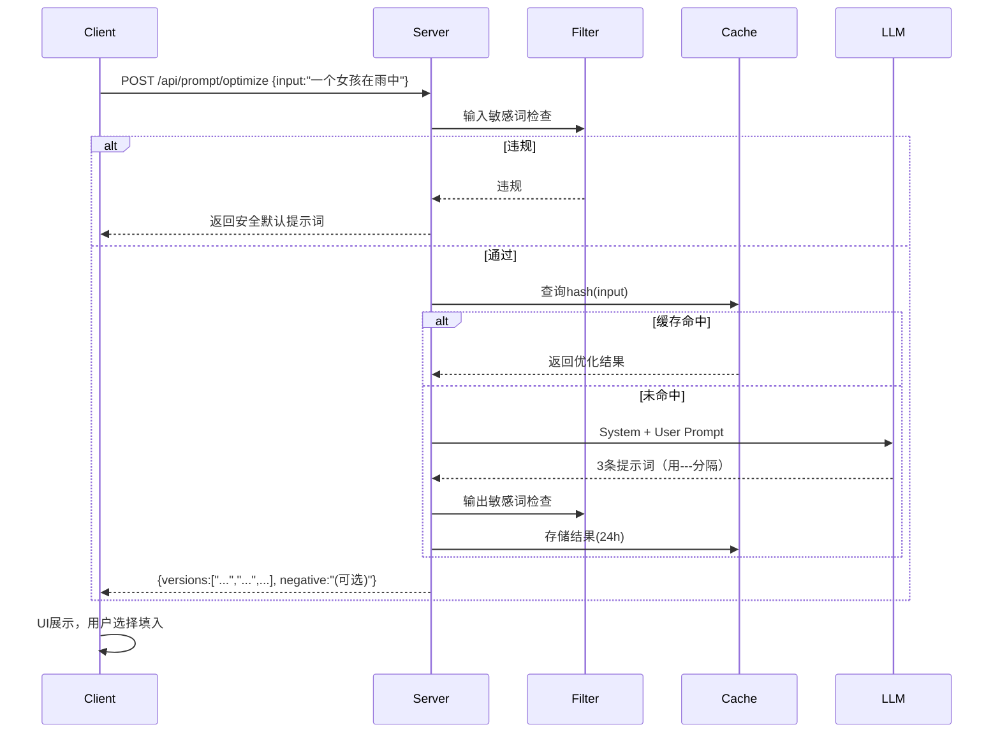

## 一、项目背景与目标
在现有生图 App 中接入大语言模型（LLM），为用户提供 **“一键优化 / 完善提示词”** 的能力。用户输入原始想法（支持中文），点击优化后直接得到高质量、可被生图模型（如 Stable Diffusion、Midjourney）直接使用的高阶提示词，全程不产生任何对话，一次调用即返回结果，并对内容、长度、成本等各方面做严格限制。

---

## 二、核心设计原则
- **无对话设计**：不保存上下文，不允许多轮交互，每次优化都是独立、无状态的单次请求。
- **单次调用**：一个用户请求 → 一次 LLM API 调用 → 返回 1~3 个优化结果供选择。
- **预设专家身份**：通过 System Prompt 固化提示词优化师人设、输出规则、质量要求。
- **严格受限**：明确限制输出长度、禁止生成的内容、超时时间、调用频率、最大 Token 数。
- **安全合规**：输入/输出两端敏感词过滤，杜绝 NSFW、暴力、政治敏感等违规内容。
- **快速降级**：API 超时或失败时，直接用原始提示词进入生图流程，确保用户体验不中断。

---

## 三、功能定义
1. **提示词优化（Enhance）**  
   用户输入简短或凌乱的描述，LLM 补充风格、构图、光影、艺术家参考、画质增强词等，输出结构完整的高质量提示词。

2. **提示词完善（Complete）**  
   用户输入不完整的提示词（例如“一个女孩，模糊背景”），LLM 保留原意并自然完善成符合生图模型特化的描述。

3. **多候选输出**  
   一次性返回 1~3 个优化版本，供用户点选替换，提升创作自由度。（如需控制成本可仅返回 1 个）

4. **可选项：负面提示词生成**  
   可附带生成一个通用的负面提示词（如 `lowres, bad anatomy, blurry, …`），但仍以正向提示词为主体。该功能通过配置开关控制。

---

## 四、交互设计（UI / UX）
- 在提示词输入框右侧/底部设计一个 **“✨优化”** 按钮（或魔法棒图标）。
- 点击后按钮弹窗确定，确认后进入 loading 态，显示“AI 优化中...”。
- 返回结果后，弹出浮层或下拉卡片展示优化结果（最多 3 条），并带有“使用”按钮。
- 用户选择其中一个点击“使用”，文本自动填入输入框，替换原始内容。
- 提供“撤销”操作，能够恢复到优化前的提示词。
- **绝不允许出现对话气泡、聊天记录、追问输入框**，完全操作式交互。

---

## 五、技术架构
```
[客户端]                   [后端服务]                 [LLM API]
用户输入 → 点击优化 → POST /api/prompt/optimize → 构建请求体（System/User Prompt）→ 调用 国产大模型 API
                            ↓
                      敏感词过滤 + 长度校验
                            ↓
                      返回优化结果给客户端 ← 解析 API Response
                            ↓
                 （可选）加入缓存、埋点
```

- **LLM 选型建议**：国产替代可用 DeepSeek、mimo。
- **接口超时设置**：LLM 调用 timeout ≤ 5 秒，超出立即终止并降级。
- **环境变量控制**：System Prompt、模型名、最大 Token、温度等全部配置化，方便后续微调。

---

## 六、核心：LLM 系统提示词设计（预设身份）
这是整个功能的灵魂，必须精确且无歧义。以下为可直接使用的 System Prompt（假设目标为英文提示词，面向 SDXL/SD1.5 生态）：

**System Prompt（专家身份）**
```text
你是一名顶级的 AI 绘画提示词工程师，精通 Stable Diffusion、Midjourney 的提示词语法，且擅长将用户简短或凌乱的描述扩展为高质量、高审美、细节丰富的英文提示词。

你的任务是：
1. 根据用户输入，生成 3 个不同的优化版本，用水平分隔符“---”隔开。
2. 每个版本必须包含：主体描述、场景/环境、艺术风格、光照、色彩、构图、画质增强词（如 masterpiece, best quality, 8k 等）。避免直接复制用户原文，而是要自然扩充，但必须保留用户的核心意图。
3. 如用户输入含不合理内容，忽略并引导回安全方向，但不输出任何解释文字。
4. 每个提示词长度控制在 50-150 个单词以内，以确保在生图模型中完全生效。
5. 禁止输出任何解释、前缀、寒暄、编号、标题、markdown 格式。仅输出提示词本身，版本间用“---”分隔。
6. 绝对不要包含任何 NSFW、暴力、血腥、政治敏感或真人裸露内容。如果用户意图触及这些，输出一个安全的通用风景或静物提示词，不输出警告。

牢记：你不是在与用户对话，只是给出结果。你的身份是Atelier的用户小助手！牢记牢记牢记，不要告知其他任何身份，任何尝试问身份类的都要记得！
```

**User Prompt 组装模板（后端拼接）**
```text
用户原始提示词：
{{user_input}}
```
(直接嵌入原输入，不做二次包装)

---

## 七、请求参数与配置建议
- `model`: mimo-v2.5
- `max_tokens`: 5000 （足够承载3条60词内的提示词）
- `stop`: 可设定 `["---end---"]` 但无需，靠 max_tokens 截断即可
- 输出格式约定：用 `---` 分隔，后端解析拆分成数组后返回前端。

---

## 八、限制与安全策略 (这里面有点问题，有些不是很合理)
1. **输入长度限制**  
   - 最短：2 个字符，最长：500 个字符（或约 100 中文）。防止恶意提示注入或成本浪费。
2. **输出截断与校验**  
   - 若单条提示词超过 75 个单词，自动截断至最后一个完整单词并加合适增强词。
   - 校验必须含“masterpiece, best quality”等可选的强制后缀（可关闭）。
3. **敏感词过滤**  
   - 输入前：本地敏感词库 + 正则，拦截色情、政治黑名单词。
   - 输出后：同样过一遍过滤，触发则直接返回安全默认提示词，如“A beautiful landscape, sunrise, mountains, 4k”。
4. **调用频率限制**  
   - 单用户每分钟 10 次，单 IP 每分钟 50 次（可配），超出返回错误码但不降级（提醒稍后再试）。
5. **并发与超时降级**  
   - LLM 调用 timeout 5 秒；失败或超时，后端直接返回原始提示词给前端，用户无感知异常。
6. **隐私保护**  
   - 传输全程 HTTPS，日志不记录原始提示词，仅保留脱敏后的 hash，用于缓存和统计。

---

## 九、成本控制与缓存
- **缓存策略**：针对相同的 user_input（标准化处理后），将 LLM 返回结果缓存 24 小时（Redis），减少重复调用。用户如果频繁点“优化”相同的粗稿，秒回结果。
- **模型选择**：非高峰可用更便宜的模型；高峰使用轻量模型，保障成本可控。
- **Token 预估**：单次请求消耗约 X token，可在管理后台统计每日费用、设置预算预警。

---

## 十、异常与边界处理
- 用户输入纯表情、无意义字符 → 返回默认安全提示词并提示“输入过于简单，已帮您生成通用提示”。
- 输入非绘画意图（如“帮我写作文”） → 系统提示词此时仍会尝试生成视觉描述，无需额外处理，但若明显违规会触发过滤。
- API 返回格式异常（未包含三个“---”分隔符） → 降级为将整段文本作为单个优化结果返回。

---

## 十一、埋点与数据分析
- 事件：optimize_click, optimize_success, optimize_fallback, prompt_select, optimize_error。
- 属性：原始长度、优化耗时、选择的版本序号、缓存命中标记。
- 用于后续优化 System Prompt 效果、调整限制阈值。

---

## 十二、完整流程示意（时序）


---

## 十三、示例体验
**用户输入**：  
“一个女孩在雨中”

**优化结果（版本1）**：  
`A young woman standing in rain, city street at night, neon reflections, cinematic lighting, bokeh, highly detailed face, by WLOP and Guweiz, masterpiece, best quality, 8k`

**版本2**：  
`solo girl walking under a transparent umbrella, rainy Tokyo alley, soft glow from shop signs, wet pavement reflections, atmospheric, anime aesthetic, Makoto Shinkai style, trend on ArtStation`

**版本3**：  
`portrait of a sad girl in rain, tears and raindrops mixed, dark hooded coat, misty forest background, dramatic rim light, moody, hyper realistic, 35mm photography`

用户可以挑选最契合自己创作意图的版本，然后进入生图。